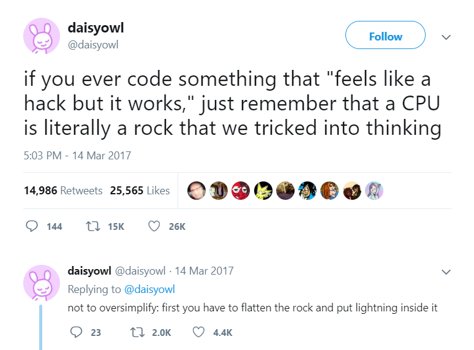

What is randomized numerical linear algebra? Let's break down the key pieces:

- **randomness** is the concession that we can't reliably predict how dice are going to land,[^rand] and
- **numerical linear algebra** is about algorithms for doing linear algebra on computers. 

[^rand]: "but dice are deterministic blah blah blah"

So, RandNLA is basically about understanding how we can use the outcomes of unpredictable dice to do linear algebra on computers better (🎲+🖥️=🎉).

It may seem unintuitive, or even disconcerting, that randomness, which we often associate with unpredicibility or unreliability, will be used as a tool in our algorithms.
We try to provide a brief justification the [role of randomness](./role-of-randomness.md) later in this chapter, but we ultimately take the pragmatic position that a philosophical justification of the use of randomness is mostly irrelevant.
Indeed, there are many examples of RandNLA algorithms that, in theory and in practice,  work better than their deterministic counterparts (with respect to essentially any reasonable metric).

In fact, this book is geared towards practical algorithms.
Numerical examples are provided throughout, with the aim of  illustrating the simplicity and effectiveness of RandNLA methods.
We also aim to provide a conceptual understanding of how and why these algorithms work.
This requires a basic understanding of [NLA](./review-NLA.md) and [probability](./review-probability.md), which we assume readers are familiar with. 
Nevertheless, we provide a brief refresher in the next section.
In addition, we need some understanding of how modern computers work.
Later in this chapter, we explore some commons ways to think about the [cost of algorithms](./cost-of-numerical-linear-algebra.ipynb), which at least gives us a handle to thinking about 

:::{aside} How do computers work?

:::
