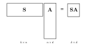

# Sketching

The workhorse of RandNLA is a technique called *sketching*. 
Sketching, broadly speaking, is a way to take a large matrix and create a smaller matrix (called a sketch) that approximates key properties of the original matrix.[^sketch]
In RandNLA, sketching is almost always done using a linear transform of the original matrix.

[^sketch]: This is like how a sketch captures the essence of an original image without all the details.

Loosely speaking, sketching can be categorized as data-oblivious or data-adaptive, depending on whether or not the sketching matrix is generated with knowledge about properties of $\vec{A}$ or not.

<h2>Oblivious Sketching</h2>

Oblivious sketching methods generate the sketching matrix $\vec{S}$ without knowledge of the input matrix $\vec{A}$ (besides the matrix dimensions).
The most common oblivious sketching distributions are:

- [Gaussian](./Gaussian-sketch.md)
- [Sparse](./sparse-sketch.md)
- [Trigonometric](./trig-sketch.md)

Each have their own pros and cost (in theory and in practice), and we will compare these methods head to head in [Numerical Experiments](./which-sketch-should-i-use.ipynb).

<h2>Adaptive Sketching</h2>

TODO
